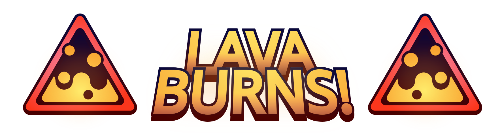

<div align="center">
  
</div>

## ❓ Introduction

In Minecraft, lava is fairly dangerous, however it's nothing compared to the real thing. In real life even standing close to lava is a guaranteed burn. This mod implements precisely that, it'll burn you not only if you're swimming in lava, but also when you stand in its vicinity, requiring the player to be even more cautious and precise, especially in the nether dimension.


## 🔥 Spatial Burning

Only two blocks will burn the player from a distance: the lava block (both the source and the rest of the fluid) and a lava-filled cauldron. Standing in a place either adjacent or diagonal to a burning source will burn you for one second. However, if you cover the adjacent places with blocks, you can cut off the effect on the diagonal. This ensures that you can't get burned by a block that you can't see.

> note: the effect also works underwater, because it gets very hot.


## 🖐️ Holding Items

Holding a bucket of lava should be incredibly dangerous. Well, now it is. Whenever you're holding a bucket of lava either in your main hand or your off hand, you're going to take damage. It's not much, but I guarantee it will make you and your friends jump!


## 🧠 Ideas

This mod works best as one of many little tweak mods in adventure and challenge modpacks, slightly rising the difficulty.
Because it's so lightweight, fully vanilla and server-side, it likely won't cause any problems or compatibility issues with your other mods.

It also double serves as a prank mod, just install it on your SMP without telling anyone and (literally) __watch the world burn__!


## Configuration

You can find the config file in `.minecraft/saves/<Your World>/lava_burns-server.toml`.

Here is the default config:

```toml
# Whether holding a bucket of lava will burn the player
bucketBurns = true
# Whether being in water will protect the player from burning
waterProtection = true
```